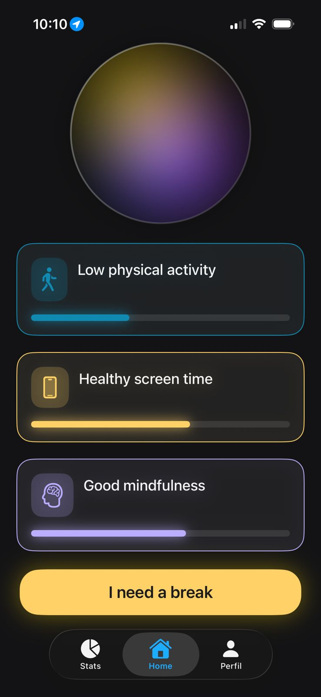
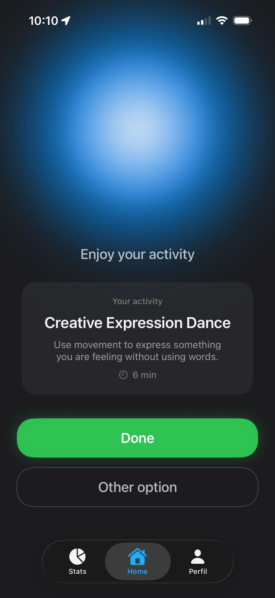
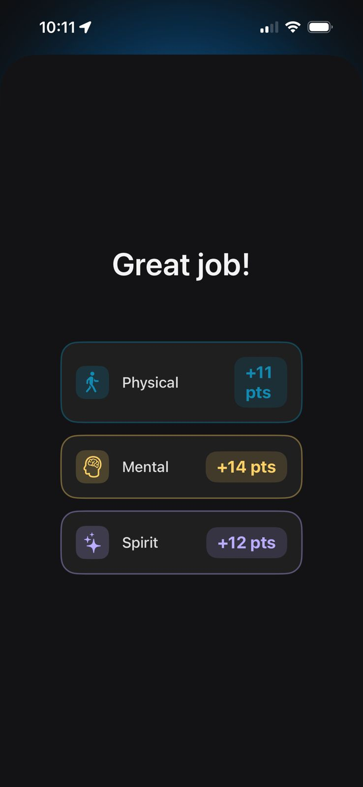
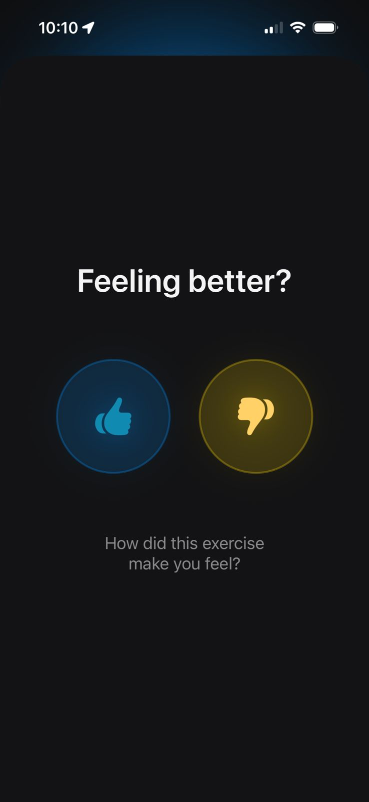
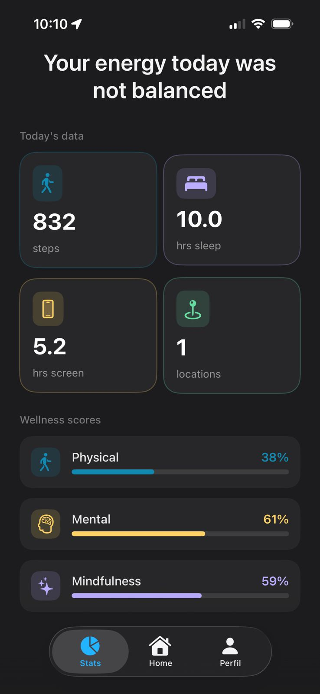
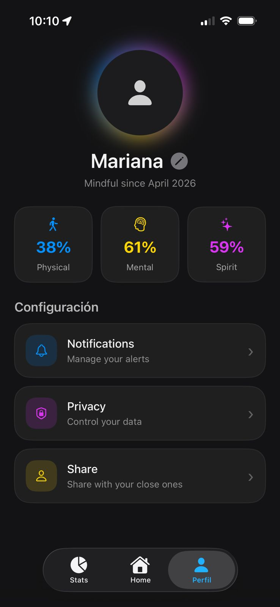

# Well-ness
### *Find your balance. Live better.*

> A Human-Centered AI wellness app for iOS that transforms invisible health data into visible, actionable decisions — and learns from you over time.

---

## Table of Contents

- [Overview](#overview)
- [Screenshots](#screenshots)
- [The Problem](#the-problem)
- [Features](#features)
- [Architecture](#architecture)
- [AI System](#ai-system)
- [Scoring Model](#scoring-model)
- [Recommendation Engine](#recommendation-engine)
- [App Screens](#app-screens)
- [Tech Stack](#tech-stack)
- [Scientific References](#scientific-references)
- [Privacy](#privacy)
- [Requirements](#requirements)
- [Installation](#installation)
- [Project Structure](#project-structure)

---

## Overview

Well-ness is an iOS application built for the **Swift Changemakers Hackathon 2026** under the theme **Human-Centered AI**.

It addresses burnout prevention through passive data collection, real-time imbalance detection, and personalized micro-interventions — all powered by an on-device adaptive AI engine that requires no internet connection and no pre-trained model file.

The app monitors three wellness dimensions simultaneously:

| Dimension | What it measures | Data sources |
|---|---|---|
| 🔴 **Body** | Physical energy | Steps, sleep, exercise |
| 🔵 **Mind** | Cognitive load | Screen time, phone unlocks |
| 🟡 **Mindfulness** | Meaningful use of time | App usage, routine, movement |

A central animated sphere reflects the live balance between all three dimensions. When one falls, the AI acts.

---

## Screenshots

<p align="center">
  
  
  
  
  
  
</p>

---

## The Problem

Burnout is not just tiredness. The World Health Organization classifies it in ICD-11 as a syndrome resulting from unmanaged chronic stress, with three dimensions: exhaustion, depersonalization, and reduced performance.

**The data:**
- 42% of women in corporate environments report chronic burnout (McKinsey, 2023)
- 1 in 5 workers in Mexico experiences severe burnout (IMSS, 2023)
- Burnout costs companies up to $190 billion USD annually in healthcare (Harvard Business Review)

**The gap:**  
Existing wellness apps show you data. They don't interpret it. They don't act on it. They don't learn from you.

Well-ness does all three.

---

## Features

- **Passive data collection** — no manual input required
- **Three-dimensional wellness model** — Body, Mind, Mindfulness
- **Animated energy sphere** — real-time visual balance indicator
- **AI-powered recommendations** — personalized micro-actions (2–10 min)
- **Adaptive feedback loop** — the model improves with every 👍 or 👎
- **On-device learning** — no internet, no servers, no data leaves the device
- **Scientifically grounded** — every threshold backed by peer-reviewed research
- **Offline-first** — fully functional without network access
- **Accessible design** — reduced cognitive load, high contrast, minimal friction

---

## Architecture

Well-ness uses a modular five-layer pipeline:

```
┌─────────────────────────────────────────────────────┐
│              DATA COLLECTION LAYER                   │
│  HealthKit · CoreLocation · DeviceActivity           │
└──────────────────────┬──────────────────────────────┘
                       │
┌──────────────────────▼──────────────────────────────┐
│              DEVICE DATA COLLECTOR                   │
│  DeviceDataCollector (orchestrates all collectors)   │
│  ├── HealthDataCollector (steps, sleep, exercise)    │
│  ├── LocationDataCollector (movement patterns)       │
│  └── ScreenTimeDataCollector (screen time estimate)  │
└──────────────────────┬──────────────────────────────┘
                       │
┌──────────────────────▼──────────────────────────────┐
│              WELLNESS SCORING ENGINE                 │
│  WellnessRuleEngine (rule-based, 70% weight)         │
│  ├── calculatePhysical()                             │
│  ├── calculateMental()                               │
│  └── calculateMindfulness()                          │
└──────────────────────┬──────────────────────────────┘
                       │
┌──────────────────────▼──────────────────────────────┐
│              ADAPTIVE AI PREDICTION LAYER            │
│  AIWellnessPredictor (adaptive, 30% weight)          │
│  ├── predictWellnessAdjustment()                     │
│  ├── updateWeights() — gradient descent              │
│  └── bootstrapFromHistory() — onboarding init        │
└──────────────────────┬──────────────────────────────┘
                       │
┌──────────────────────▼──────────────────────────────┐
│              RECOMMENDATION ENGINE                   │
│  RecommendationPipeline                              │
│  ├── RuleBasedRecommendationScorer (65%)             │
│  └── AIRecommendationScorer (35%)                    │
└──────────────────────┬──────────────────────────────┘
                       │
┌──────────────────────▼──────────────────────────────┐
│              STATE & UI LAYER                        │
│  WellnessStore (@Observable, iOS 17)                 │
│  SwiftUI Views                                       │
└─────────────────────────────────────────────────────┘
```

### Key design principles

- **Single source of truth** — `WellnessStore.shared` is the only state container, observed by all views via `@Environment`
- **Dependency injection** — all backend components accept protocol-based dependencies for testability
- **Modular layers** — each layer can be replaced independently without touching the rest
- **MainActor safety** — all UI mutations dispatched to main thread via `@MainActor`

---

## AI System

Well-ness replaces static CoreML models with a **lightweight adaptive regression engine** implemented entirely in Swift.

### Why not Core ML or Create ML?

| Framework | Reason discarded |
|---|---|
| Core ML | Requires a pre-trained `.mlmodel` file; no real-time weight updates |
| Create ML | Full retraining required per update; computationally expensive |
| Foundation Models | Internet dependency; data leaves the device |

### How it works

**Final score formula:**
```
finalScore = (ruleEngine × 70%) + (adaptiveAI × 30%)
```

**Prediction formula:**
```
prediction = w₁x₁ + w₂x₂ + ... + w₈x₈ + bias
```

Where `x₁...x₈` are normalized health metrics and `w₁...w₈` are adaptive weights stored locally.

**Weight update (Gradient Descent):**
```
error  = (userMoodScore / 100) − prediction
wᵢ     = clamp(wᵢ + η × error × xᵢ − decay × wᵢ,  minWeight, maxWeight)
bias  += η × error
```

### Three phases

**Phase 1 — Bootstrap (first launch):**  
Reads the last 30 days of HealthKit history. Computes per-feature means. Assigns initial weights proportionally to how much each feature's mean exceeds the cross-feature average. A user who walks 12,000 steps but sleeps 5 hours starts with a high step-weight and a low sleep-weight — accurate predictions from day one, no feedback required.

**Phase 2 — Daily prediction:**  
On every `runDailyAnalysis()` call, the predictor normalizes the current day's metrics and computes a weighted dot-product to produce a personalized mood score (0–100). This score blends with the rule-based score to generate the final wellness breakdown.

**Phase 3 — Continuous learning:**  
After every 👍 or 👎 from the user, `updateWeights()` runs one gradient descent step. The model gradually aligns with the user's actual emotional and behavioral patterns. A warm-up blend factor ramps the AI contribution from 0% to 30% over the first `adaptiveWarmupEntries` feedback submissions, preventing the model from influencing scores before it has learned anything.

**All state persisted locally in UserDefaults:**
```
adaptive.weights.v1
adaptive.bias.v1
adaptive.feedbackCount.v1
adaptive.isBootstrapped.v1
```

---

## Scoring Model

All thresholds and weights are centralized in `ScoringConstants.swift`.

### Physical Score
```
physicalScore = (stepsScore × 0.40) + (sleepScore × 0.35) + (exerciseScore × 0.25)

stepsScore    = min(steps / 10,000, 1.0) × 100
sleepScore    = min(sleepHours / 8.0, 1.0) × 100
exerciseScore = min(exerciseMinutes / 30.0, 1.0) × 100
```

| Metric | Threshold | Reference |
|---|---|---|
| Steps | < 5,000 low · ≥ 10,000 optimal | Tudor-Locke et al. (2011) · WHO |
| Sleep | < 6h insufficient · 7–9h optimal | National Sleep Foundation · CDC |
| Exercise | < 10 min very low · ≥ 30 min optimal | WHO physical activity guidelines |

### Mental Score
```
mentalScore = (screenScore × 0.35) + (unlockScore × 0.30) + (sleepScore × 0.35)

screenScore = max(0, 1 − screenTimeHours / 8.0) × 100
unlockScore = max(0, 1 − unlockCount / 100.0) × 100
```

| Metric | Threshold | Reference |
|---|---|---|
| Screen time | < 3h healthy · > 5h high | Twenge et al. (2018) · APA |
| Unlocks | < 50 low · > 100 compulsive | Deloitte Global Mobile Survey |

### Mindfulness Score
```
// Starts at 50 (neutral), adjusted by behavior signals
score = 50
if educationTime > 1h   → +20
if productivityTime > 2h → +10
if socialMediaTime > 3h  → −20
if passiveRatio > 0.7    → −20
if diversityScore < 3    → −10
if locationsVisited < 2  → −10
mindfulnessScore = clamp(score, 0, 100)
```

---

## Recommendation Engine

Recommendations are selected using a two-layer hybrid scoring system:

```
finalRecommendationScore = (ruleScore × 65%) + (aiScore × 35%)
```

**Rule-based scorer (65%):**
Evaluates how well each recommendation addresses the user's weakest wellness dimension, weighted by estimated benefit and task efficiency.

**AI scorer (35%):**
Uses the adaptive predictor to estimate the user's current mood state, then selects the recommendation most likely to be emotionally appropriate at this specific moment — not just objectively correct.

The recommendation database contains **150+ entries** across five categories:
- Physical exercise snacks (2–10 min)
- Mindfulness & meditation
- Journaling (ACT therapy-based)
- Music therapy
- Expressive movement / dance

Every recommendation has `physicalWeight`, `mentalWeight`, and `mindfulnessWeight` values that determine which wellness dimension it targets.

---

## App Screens

| Screen | Description |
|---|---|
| **Onboarding** | First-launch permission request + 30-day HealthKit bootstrap |
| **InsightScreen** (Home tab) | Live energy sphere · insight cards · recommendation card · "I need a break" button |
| **ActionScreen** | Breathing animation · personalized activity title · Done / Other option |
| **FeedbackScreen** | 👍 / 👎 — completes or rejects recommendation, triggers model update |
| **HomeDashboard** (Stats tab) | Physical, Mental, Mindfulness scores with loading state |
| **ProfileScreen** | Editable name · live wellness stats · notification & privacy settings |
| **GenericWellnessTipsView** | Static tips shown when permissions are denied |

### User flow
```
App launch
    │
    ├─ First time → Onboarding (permissions + bootstrap)
    └─ Returning  → MainTabView directly
                         │
                    InsightScreen
                    (sphere + insights + recommendation)
                         │
                    "I need a break"
                         │
                    ActionScreen
                    (breathing + activity)
                         │
                    Done button
                         │
                    FeedbackScreen
                    ├─ 👍 → mark complete → update AI weights → InsightScreen
                    └─ 👎 → reject → new recommendation → ActionScreen (loop)
```

---

## Tech Stack

| Technology | Usage |
|---|---|
| **Swift 5.9** | Primary language |
| **SwiftUI** | All UI layers |
| **Swift Observation (`@Observable`)** | State management (iOS 17+) |
| **HealthKit** | Steps, sleep, exercise data |
| **CoreLocation** | Movement and location patterns |
| **DeviceActivity / FamilyControls** | Screen time estimation (iOS only) |
| **UserNotifications** | Wellness reminders |
| **UserDefaults** | Adaptive AI weight persistence |
| **DispatchQueue** | Thread-safe weight updates |
| **Xcode 15+** | Development environment |

No third-party dependencies. No external APIs. No network calls.

---

## Scientific References

| Category | Reference |
|---|---|
| Burnout classification | WHO ICD-11 |
| Physical activity | Tudor-Locke et al. (2011) · WHO guidelines |
| Sleep | National Sleep Foundation · CDC |
| Screen time | Twenge et al. (2018) · APA |
| Phone unlocks | Deloitte Global Mobile Consumer Survey |
| Social isolation | Holt-Lunstad et al. (2015) |
| Digital well-being | OECD Digital Well-being Framework |
| Journaling | ACT therapy — MyLifeNote · Mental Health First Aid |
| Meditation | UCLA Mindful |
| Music therapy | JED Foundation · Positive Psychology |
| Exercise snacks | The Conversation · MDPI Healthcare (2025) |
| Hybrid AI systems | arXiv:2007.02845 |
| Human-Centered AI | Stanford HAI |

---

## Privacy

Well-ness is designed privacy-first:

- **Zero network calls** — the app never contacts external servers
- **All data stays on device** — HealthKit data, location patterns, and AI weights never leave the user's iPhone
- **UserDefaults only** — adaptive weights are stored locally under namespaced keys
- **No analytics** — no crash reporting, no usage tracking, no third-party SDKs
- **Permission-gated** — HealthKit, Location, and Notifications are requested explicitly before any data is read

---

## Project Structure

```
Hackathon/
├── HackathonApp.swift              # App entry point, WellnessStore injection
├── ContentView.swift               # Root navigation, permission flow
├── MainTabView.swift               # Tab container (Home · Stats · Profile)
│
├── Views/
│   ├── Onboarding.swift            # First-launch permissions + bootstrap
│   ├── InsightScreen.swift         # Home tab — sphere, insights, recommendation
│   ├── ActionScreen.swift          # Breathing animation + activity
│   ├── FeedbackScreen.swift        # 👍 / 👎 feedback
│   ├── HomeDashboard.swift         # Stats tab — wellness scores
│   ├── ProfileScreen.swift         # Profile tab — editable name, stats, settings
│   └── GenericWellnessTipsView.swift  # Fallback when permissions denied
│
├── Backend/
│   ├── Models.swift                # HealthMetrics, WellnessBreakdown, Recommendation
│   ├── WellnessStore.swift         # @Observable global state
│   ├── WellnessBackend.swift       # Main orchestrator
│   ├── WellnessScoring.swift       # Rule engine + ML engine + WellnessEngine
│   ├── ScoringConstants.swift      # All thresholds and weights
│   ├── AIWellnessTuner.swift       # AdaptiveWellnessPredictor
│   ├── DataCollector.swift         # DeviceDataCollector orchestrator
│   ├── DataProviders.swift         # HealthDataProvider protocol
│   ├── HealthDataCollector.swift   # HealthKit integration
│   ├── LocationDataCollector.swift # CoreLocation integration
│   ├── ScreenTimeDataCollector.swift  # DeviceActivity integration
│   ├── PermissionsManager.swift    # Centralized permission requests
│   ├── RecommendationDatabase.swift   # 150+ recommendation entries
│   ├── RecommendationEngine.swift  # Scoring and selection logic
│   ├── RecommendationPipeline.swift   # Accept / reject / complete flow
│   ├── RecommendationScoring.swift    # Rule + AI hybrid scorer
│   └── RecommendationSystem.swift  # Protocol definitions
│
└── Assets.xcassets/               # App icons and colors
```
